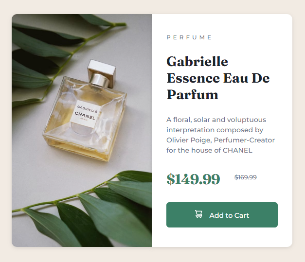
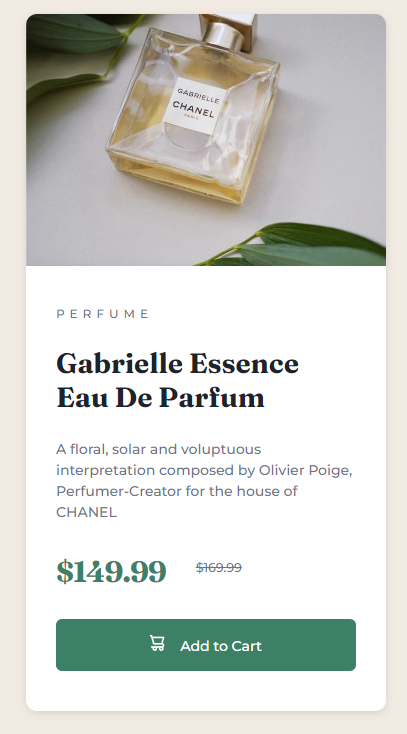

# Frontend Mentor - Product preview card component solution

This is a solution to the [Product preview card component challenge on Frontend Mentor](https://www.frontendmentor.io/challenges/product-preview-card-component-GO7UmttRfa). Frontend Mentor challenges help you improve your coding skills by building realistic projects. 

## Table of contents

- [Overview](#overview)
  - [The challenge](#the-challenge)
  - [Screenshot](#screenshot)
  - [Links](#links)
- [My process](#my-process)
  - [Built with](#built-with)
  - [What I learned](#what-i-learned)
  - [Continued development](#continued-development)
  - [Useful resources](#useful-resources)
- [Author](#author)

## Overview

### The challenge

Users should be able to:

- View the optimal layout depending on their device's screen size
- See hover and focus states for interactive elements

### Screenshot




### Links

- Solution URL: [Add solution URL here](https://your-solution-url.com)
- Live Site URL: [Add live site URL here](https://your-live-site-url.com)

## My process

### Built with

- CSS custom properties
- Flexbox

### What I learned

- Centering a div vertically using flexbox requires a height from the parent element.
```
body {
    display: flex;
    justify-content: center;
    align-items: center;
    background: hsl(30, 38%, 92%);
    font-size: 14px;
    height: 100vh;
}
```
- The difference between max-width and width. 
- The difference between using a percentage and pixels as units of measurement.
- Achieving rounded corners using border radius on the parent container yields very little aesthetic change. It is better to apply on the items.
- Box shadow property automatically accounts for border-radius.
- Object fit is important for preserving aspect ratio when changing width.
- The combination of media query and display of value none to replace images.
```
img {
    max-width: 50%;
    height: auto;
    border-top-left-radius: 11px;
    border-bottom-left-radius: 11px;
    box-shadow: rgba(99, 99, 99, 0.2) 0px 2px 8px 0px;
    object-fit: cover;
}

.image-mobile {
    display: none;
}

.image-desktop {
        display: none;
    }

    .image-mobile {
        max-width: 100%;
        display: block;
        border-bottom-left-radius: 0;
        border-top-right-radius: 11px;
    }
```

### Continued development

- Mobile-first workflow
- Responsiveness
- Semantic html
- Working with SVG and better positioning

### Useful resources

- https://css-tricks.com/snippets/css/a-guide-to-flexbox/#aa-examples - Straightforward Flexbox guide

## Author

- Name - [Hae Choi]
- Frontend Mentor - [@dagimchi](https://www.frontendmentor.io/profile/dagimchi)
- Twitter - [@dagimchi](https://www.twitter.com/dagimchi)

